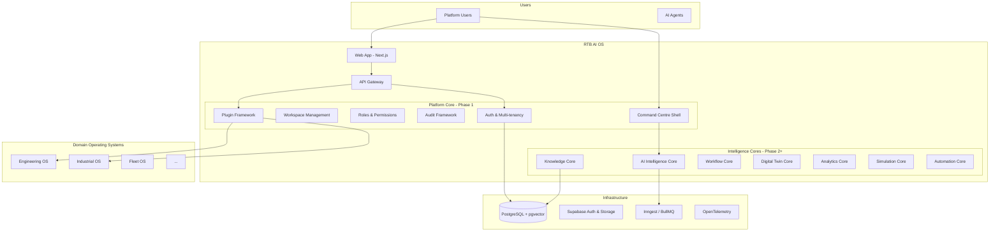

# RTB AI OS — Architecture Overview

## Vision

RTB AI OS is an enterprise AI Operating System — not a traditional SaaS application. It provides a shared intelligence core that multiple industry-specific operating systems build upon, each installed as a plugin without modifying platform core.

## Design Principles

| Principle | Implementation |
|-----------|----------------|
| Modular | Monorepo with independent packages; each core is a bounded context |
| Domain-driven | Types and services organized by domain (tenant, auth, audit, plugin) |
| Event-driven | Audit events, workflow events (Phase 2), domain events via message queue |
| API-first | REST/GraphQL APIs with typed contracts; UI consumes same APIs |
| AI-first | Command Centre as primary interaction surface |
| Cloud-native | Supabase, horizontal scaling, stateless services |
| Multi-tenant | RLS at database layer; tenant_id on all domain tables |
| Enterprise secure | Immutable audit, RBAC, encryption, least privilege |

## System Context



## Monorepo Structure

```
rtb-ai-os/
├── apps/
│   └── web/                    # Next.js 15 — dashboard shell, Command Centre
├── packages/
│   ├── types/                  # Domain types (Tenant, Workspace, Role, Plugin)
│   ├── database/               # Supabase client, schema, generated types
│   ├── platform-core/          # Platform services (auth, audit, permissions)
│   ├── plugin-sdk/             # Plugin manifest, validation, registry
│   └── ui/                     # Shared React components
├── supabase/
│   └── migrations/             # Versioned SQL migrations
└── docs/
    └── architecture/
```

## Layered Architecture

Each package follows Clean Architecture layers:

```
┌─────────────────────────────────────┐
│  Presentation (apps/web)            │  Pages, components, API routes
├─────────────────────────────────────┤
│  Application (platform-core)        │  Services, use cases, orchestration
├─────────────────────────────────────┤
│  Domain (types)                     │  Entities, value objects, interfaces
├─────────────────────────────────────┤
│  Infrastructure (database)          │  Supabase, repositories, external APIs
└─────────────────────────────────────┘
```

## Multi-Tenancy Model

```
Tenant (organization)
  ├── Roles (owner, admin, member, viewer)
  ├── Tenant Memberships (user ↔ role)
  ├── Workspaces
  │     └── Workspace Memberships
  ├── Installed Plugins
  ├── Audit Events
  ├── Command Centre Sessions
  └── Platform Settings
```

Isolation is enforced at three levels:

1. **Database** — Row Level Security policies on every table
2. **Application** — PermissionService checks before operations
3. **API** — Middleware validates session and tenant context

## Plugin Architecture

Operating systems register via `@rtb/plugin-sdk`:

1. **Manifest** — Validated with Zod; declares id, version, permissions, routes, navigation
2. **Registry** — In-memory registry (Phase 1); database-backed in production
3. **Lifecycle** — onInstall, onUninstall, onEnable, onDisable hooks
4. **Integration** — Plugins contribute routes and nav items to the platform shell

Future operating systems plug in without platform core changes.

## Phase 1 Deliverables (Current)

- [x] Monorepo scaffold (pnpm + Turborepo)
- [x] PostgreSQL schema with RLS
- [x] Authentication (Supabase Auth + profiles)
- [x] Multi-tenancy (tenants, memberships)
- [x] Workspace management
- [x] Role management (system roles)
- [x] Dashboard shell with navigation
- [x] Plugin architecture SDK
- [x] Audit framework (immutable events)
- [x] Settings infrastructure
- [x] AI Command Centre shell
- [x] Health check API

## Phase 2 Roadmap

1. **AI Intelligence Core** — Agent orchestration, model routing, memory, tools
2. **Knowledge Core** — RAG, vector search, citations
3. **Engineering Operating System** — First full domain OS
4. **Workflow Core** — BPM, approvals, human-in-the-loop
5. **Observability** — OpenTelemetry, Langfuse, Phoenix

## Technology Decisions

| Concern | Choice | Rationale |
|---------|--------|-----------|
| Frontend | Next.js 15 + React 19 | App Router, SSR, API routes, enterprise ecosystem |
| UI | Tailwind + shadcn-style | Consistent, accessible, themeable |
| Backend | Node.js + Python (AI) | Node for platform; Python for ML/AI services |
| Database | PostgreSQL + Supabase | RLS, auth, storage, realtime in one platform |
| Vector | pgvector | Co-located with relational data; hybrid search |
| Queue | Inngest or BullMQ | Event-driven workflows and job scheduling |
| AI | GPT, Claude, Gemini | Multi-model routing with local model support later |

## Security Requirements

- No AI system may approve engineering decisions autonomously
- All critical actions require human approval (Workflow Core, Phase 2)
- Audit events are immutable at the database level
- Service role key used only in server-side contexts
- RLS enabled on every tenant-scoped table

## Extensibility

The architecture supports hundreds of modules:

- Each operating system is a plugin with its own package
- Platform cores expose service interfaces consumed by plugins
- Database migrations are versioned and reversible
- API contracts are typed and versioned
