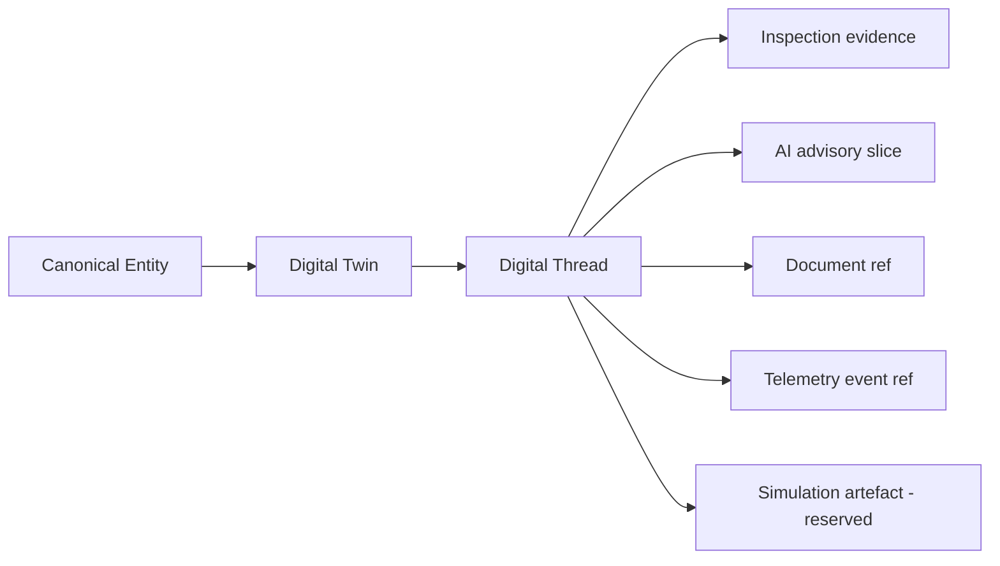

# Digital Thread Model (Phase 12A)

Status: discovery · **no digital_thread found** in repository before Phase 12A

## Thread model

The Digital Thread is the provenance chain that links evidence, models,
simulations, inspections, documents, and telemetry observations to a Twin
without replacing canonical registers.

## Thread link types (draft)

| Link kind | Source owner | Twin relation |
| --- | --- | --- |
| inspection_observation | inspection_intelligence | consumes |
| condition_assessment | asset_intelligence | consumes |
| document_derivative | project_intelligence | consumes |
| telemetry_event | platform_kernel_telemetry | consumes |
| sensor_stream_segment | shm | consumes |
| simulation_run | digital_twin | reserved — execution forbidden in 12A |

## Persistence

No `digital_thread` table exists today. Phase 12A defines the model only.
Phase 12B will choose persistence aligned with kernel `digital_twin_relationships`
and KG edges — not a duplicate provenance store.

## Provenance rules

- Thread links are append-oriented; canonical identity mutation remains forbidden
- AI outputs enter the thread as **derived** state category only
- Autonomous thread mutation without human review is forbidden in discovery lock
