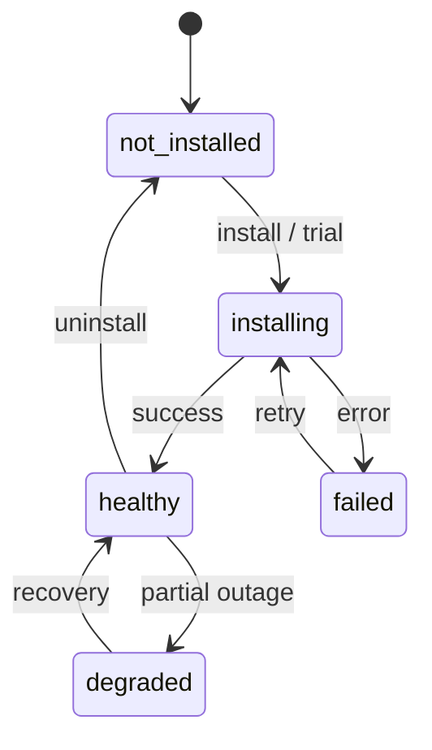

# Product Installation Lifecycle

## Status dimensions

Platform Commerce treats product and application state as three independent dimensions. The UI never collapses these into a single “Installed” badge.

### Subscription status

Maps to future `commercial_subscriptions.status`.

| Status | Meaning |
|--------|---------|
| `trialing` | Evaluation period active |
| `active` | Paid or entitled subscription active |
| `past_due` | Payment overdue |
| `cancelled` | Cancelled but may retain access until period end |
| `expired` | No active subscription |

### Licence status

Maps to future `commercial_licenses.status`.

| Status | Meaning |
|--------|---------|
| `active` | Licence valid for use |
| `suspended` | Administratively suspended |
| `expired` | Licence no longer valid |

### Installation status

Maps to future `product_installations.status` and `application_installations.status`.

| Status | Meaning |
|--------|---------|
| `not_installed` | Not provisioned for tenant |
| `installing` | Provisioning in progress |
| `healthy` | Installed and operational |
| `degraded` | Installed with partial impairment |
| `failed` | Installation or runtime failure |

## Catalogue placement

| Tab | Condition |
|-----|-----------|
| Installed | Active subscription + healthy/degraded installation |
| Available | Product commercially available, not installed |
| Trials | Trialing subscription |
| Coming Soon | Registered in catalogue, not commercially available |

## Engineering OS lifecycle (current tenant)

| Dimension | Seeded value | Notes |
|-----------|--------------|-------|
| Subscription | `active` | Placeholder until billing integration |
| Licence | `active` | Tenant entitlement assumed when `engineering_os_enabled` |
| Installation | `healthy` | Core `/engineering` routes operational |

## Application lifecycle

Applications under a parent OS follow the same three status dimensions on application cards. Installation actions (`install`, `start_trial`, `request_quote`) are UI shells until Platform Commerce workflows connect.

## Future backend flow

Data flow when Platform Commerce is live:

1. `commercial_products` + `commercial_plans` define catalogue
2. `commercial_subscriptions` drives subscription chip
3. `commercial_licenses` drives licence chip
4. `product_installations` / `application_installations` drive installation chip
5. `commercial_seat_pools` and `commercial_usage_aggregates` feed summary cards

The UI adapter in `packages/platform-core/src/commerce/` is the single mapping boundary between these tables and tenant-facing components.
