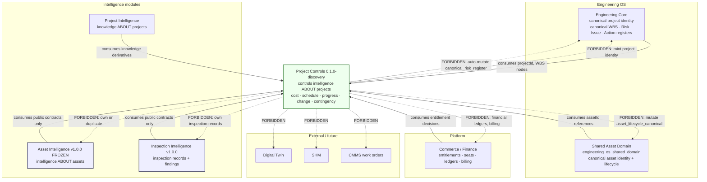

# Project Controls — boundary map (discovery)

Status: discovery · Module version: `0.1.0-discovery` · Phase: 11A

Three relations, and nothing in between: Project Controls **owns** a concern,
**consumes** it through a public contract, or is **forbidden** from it. The
relation for every concern is fixed in
`packages/project-controls/src/architecture/ownership-lock.ts` and can be
queried with `listConcernsByRelation()`.

Solid arrows are permitted consumption, pointing from the owner into Project
Controls. Dotted arrows are prohibitions.

## Owns

Concerns where Project Controls is the owner. All are future work; none has an
implementation in Phase 11A.

| Concern key | Description |
| --- | --- |
| `cost_controls_intelligence` | Planned, committed and incurred cost positions and their variance |
| `schedule_controls_intelligence` | Activities, milestones, baselines and schedule variance |
| `progress_controls_intelligence` | Measured physical progress against defined scope |
| `change_controls_intelligence` | Change requests, variations and trends |
| `contingency_controls_intelligence` | Contingency pools and drawdown history |

`earned_value` is reserved to Project Controls by domain but carries the
`forbidden` relation in Phase 11A: no other module may claim it, and Project
Controls may not implement it yet.

## Consumes

Concerns Project Controls reads through a public contract and never owns.

| Concern key | Owner |
| --- | --- |
| `project_identity_canonical` | `engineering_core` |
| `project_hierarchy_wbs_canonical` | `engineering_core` |
| `project_knowledge` | `project_intelligence` |
| `project_documents` | `project_intelligence` |
| `meeting_intelligence` | `project_intelligence` |
| `asset_identity_canonical` | `engineering_os_shared_domain` |
| `asset_intelligence` | `asset_intelligence` (frozen V1) |
| `inspection_intelligence` | `inspection_intelligence` |
| `entitlements_seats_licensing` | `platform_commerce_finance` |

Consumption rules:

1. Public contracts only. No reach-through into another module's repositories,
   private schema or internal types.
2. Read-only. Consumption never writes back into the owner's canonical state.
3. Reference by identifier. Project Controls stores `projectId` and `assetId`
   references, never copies of the canonical records.

## Forbidden

Concerns Project Controls must not implement, own or mutate.

| Concern key | Owner | Why forbidden |
| --- | --- | --- |
| `earned_value` | `project_controls` | Reserved; requires trustworthy cost + schedule + progress first |
| `asset_lifecycle_canonical` | `engineering_os_shared_domain` | Canonical lifecycle transitions belong to the shared domain |
| `canonical_risk_register` | `engineering_core` | Auto-creation or auto-mutation of Core Risk is never permitted |
| `financial_ledgers_billing` | `platform_commerce_finance` | Money movement is a finance system of record |
| `digital_twin` | `external_future` | Out of scope |
| `structural_health_monitoring` | `external_future` | Out of scope |
| `cmms_work_orders` | `none_in_project_controls` | No work order execution in Project Controls |

Additionally forbidden for the duration of Phase 11A, regardless of eventual
ownership: earned value calculation, Critical Path Method scheduling, cost
engines, budget ledgers, schedule execution, work packaging UI, Project Controls
SQL product tables and any Project Controls product page.
